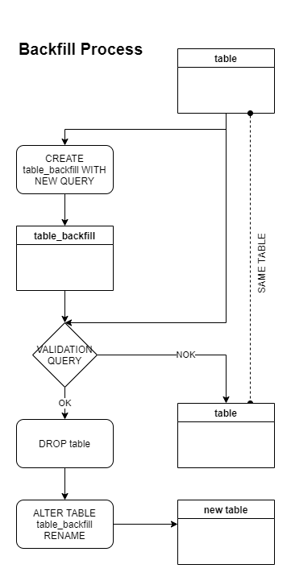

### Delete this section when productizing:
In the README.md template what you will need to replace is after the "ALTER: " tag, change it according to your project and delete the text "ALTER: "\
**The template basis on Hybris Orders Events, so you have to change all of the"Hybris" of the code** 

# ALTER: PROJECT NAME

> ALTER: Brief description of the project

ALTER:
[](https://undraw.co/)

## Business Context

ALTER: TBD

## Development Setup

> Normal flow

## ETL Architecture
https://app.diagrams.net/#G1QrfYxmYUeJ9mt5Gv8tEWnktpb7kH6sQx

## Local Setup (will be automated with Makefile soon)
 - install python 3.x
 - clone repository
 - create env
 - install pip
 - install node
 - install docker
 - install serverless
 - update citadel directory
 - install requirements
 - create file .aws/credentials on user root (template on folder template)
 - create file .leucothea/config on user root (template on folder template)
 - include template folder into .gitignore

### Ingestion to DW

We bring all data from S3 via `snowpipe` to table ALTER: **PROJECT.SCHEMA.TABLE**\
On Snowflake we use `stream` to monitor new data coming from S3, and guarantee untouched data on raw. 
We use a `task` to run every five minutes and clone the new data to ALTER: **PROJECT.SCHEMA.TABLE**\
We create one more `task` to monitor the streamed table (which runs every `5` minutes), and if the table has more than `500` rows it will triger the ETL.
We use most of available snowflake tools to create this automated process, combining `stream`, `tasks`, `procedures` and `external functions`

Below we have the code to **monitor pipes**, streams and taks:\

ALTER:

```sql
SHOW pipes IN PROD_RAW.ECS_ECOMMERCE

SHOW streams IN PROD_RAW.ECS_ECOMMERCE;

SHOW tasks IN PROD_RAW.ECS_ECOMMERCE;

SHOW tasks IN PROD_RAW_PROCESSED.ECS_ECOMMERCE;

SHOW procedures IN PROD_RAW_PROCESSED.ECS_ECOMMERCE;

SELECT 
    state
    , error_message
    , scheduled_time
FROM  TABLE(information_schema.task_history(task_name=>'ORDERS_TASK1'));
```

## serverless.yml
The [serverless](https://www.serverless.com/) is all-in-one development & monitoring & deployment of auto-scaling apps on AWS Lambda.
We config the credentials using the following parameters: --provider --key --secret  --region --stage  --app.\
The parameters will be passed to the serverless run the deploy on aws, creating a lambda that points to a docker image on ecr: 
- provider=always aws,  
- key=aws key, 
- secret=aws secret, 
- region=always us-east-1, 
- stage=dev or prod, 
- app=account id for dev or prod\
**It always change only the ${self:provider.tags.application}**

## Dockerfile
The docker file is responsible for building the docker image (used by the CI/CD) in the AWS ECR with all the project content so that the lambda runs based on the image.
The dockerfile build all the projects folder on FUNCTION_DIR="/function" to run successfully on lambda (except the great expectation package, which is cloned on the root folder).\
**It usually doesn't change**

## Github files
Templates for Github Actions and Pull Request Descripition
- pipeline-dev.yml (Change APP_NAME and APP_NAMESPACE)
- pipeline-prod.yml (Change APP_NAME and APP_NAMESPACE)
- pull_request_template.md\
**They always change only the APP_NAME and APP_NAMESPACE**

## (extract|transform)_validation.py


## extract.py

Data from S3 is always coming as a json file. To facilitate the use of raw data (from data analitics team, other tech and business users) whe transform the json file on a tabular format (and is easy to apply business rules on sql).\
With the validated dataframe from previuos step we normalize it and insert on ALTER: **PROD_RAW_PROCESSED.ECS_ECOMMERCE.ORDERS** and create a temporary table with only new values to use in the next steps ALTER:(**PROD_RAW_PROCESSED.ECS_ECOMMERCE.ORDERS_NORMALIZED_TEMP**)

Sample:\
raw json file\
ALTER: 
```json
{
    "order_number": "1234",
    "date": "2021-08-04",
    "products": [
        {
            "sku": "001",
            "quantity": 1,
        },
        {
            "sku": "002",
            "quantity": 1,
        }
    ]
}
```

Normalized table\
ALTER: 
order_number | date | sku | quantity
-------------|------|-----|------------
1234 | 2021-08-04 | 001 | 1
1234 | 2021-08-04 | 002 | 1


## transformation.py

Here is where we take normalized data, apply `business rules` and `create` transformed temporary table ALTER: **PROD_RAW_PROCESSED.ECS_ECOMMERCE.ORDERS_TRANSFORMED_TEMP**\
When the transformation process successfully finishes, we `drop` the normalized temporary table on ALTER: **PROD_RAW_PROCESSED.ECS_ECOMMERCE.ORDERS_NORMALIZED_TEMP**

## loading.py

After passing through `transform_validation`, we get all data from transformed table and use the id column to exclude from ALTER: **PROD_ANALYTICS.ANALYTICS_STAGING.STG_ECOMM_ORDER_ITEMS** all id that already is in it\

Then, we upload this dataframe in ALTER: **PROD_ANALYTICS.ANALYTICS_STAGING.STG_ECOMM_ORDER_ITEMS**, then truncate the streamed table and drop the transformed temporary table.


> Backfill flow

## create_snow_tasks.py

Here we create all needed streams, tasks, tables and procedures to automate snowflake etl trigger.\ **Execute task_classes/create_snow_tasks.py and run backfill once before execute the lambda (for new git repositories)**

Before running this script, you need to create the stream of the raw table using the Loader role in Snowflake, then the script will be able to replace this stream with Transformer role

To run this script you will need to pass 2 arguments: 

```
python create_snow_tasks.py env stage
```

## (extract|transform)_validation.py


## extraction.py and transformation.py

The Backfill process need to be executed when:
* add new columns
* add new business rule
* we need to reprocess table to fix historical values

The process will recreate the following tables:\
ALTER: 
* PROD_RAW_PROCESSED.ECS_ECOMMERCE.ORDERS
* PROD_ANALYTICS.ANALYTICS_STAGING.STG_ECOMM_ORDER_ITEMS

Other diferences of a backfill execution, it is using data directily from ALTER: **PROD_RAW.ECS_ECOMMERCE.ORDERS**\
It will recalculate all columns/metrics

The Backfill validation process consists in compare values from actual `table and` `table_backfill` (new table with alterations). If don't have diferences, it will drop the "actual" table and rename the `table_backfill` to the `table` name

For the normal process dont impact backfill, the process suspend the `task trriger` in the star and resume it in the end



## Run local and Testing

To execute ALTER: atlas-hybris-orders on the CLI, you need to:
* Create repository on AWS ECR (only for the first time)
* Build Docker 
```
aws ecr get-login-password --region us-east-1 --profile {stage} | docker login --username AWS --password-stdin {acount-id}.dkr.ecr.us-east-1.amazonaws.com\
aws ecr create-repository --repository-name {repository-name} --image-scanning-configuration scanOnPush=true --image-tag-mutability MUTABLE\
docker build . -t {etl-name}:latest --build-arg ssh_prv_key="$(cat ~/.ssh/id_rsa)" --build-arg ssh_pub_key="$(cat ~/.ssh/id_rsa.pub)"\
docker tag {etl-name}:latest {acount-id}.dkr.ecr.us-east-1.amazonaws.com/{etl-name}:latest\
docker push {acount-id}.dkr.ecr.us-east-1.amazonaws.com/{etl-name}:latest\
```
* Edit main.py (code below) (only for the first time, and only local)

When executing main.py, you need to simulate an input in a lambda function(event) changing the `if __name__ == 'main'` structure. The image below will show how to do this.\
ALTER:
```python
if __name__ == "__main__":
    #main(sys.argv, {})
    event = {
        "stage": "dev",
        "env": "aws",
        "task": "extract",
        "mode": "nobackfill",
        "lambdaName": "dev-amaro-atlas-etl-template-lambda",
        "hasExtraction": true,
        "kwarg": "'null'",
        "data": {}
    }
    main(event, {})
```

Inside this dict we will have all data we need to execute the ETL. The key 'task' will choose which step the execution will run and the key 'mode' will choose if is backfill or not.

This will run only one task, which is the same one specified in the event dict. If you want to test the execution of all tasks at once in just one execution, make the following code change:\
ALTER:
```python
    if mode == 'backfill':
        log.info("Backfill start time: " + start_time)
        log.info("Running in {stage}...".format(stage=stage))
        
        # Caso queira testar o Backfill
        #event = ecomm_etl.execute_task_backfill(task, event)
        event = ecomm_etl.execute_task_backfill('extract', event)
        event = ecomm_etl.execute_task_backfill('extract_validation', event)
        event = ecomm_etl.execute_task_backfill('transform', event)
        event = ecomm_etl.execute_task_backfill('transform_validation', event)
        event = ecomm_etl.execute_task_backfill('load', event)

    else:
        log.info("Start time: " + start_time)
        log.info("Running in {stage}...".format(stage=stage))

        # Caso queira testar o processo normal
        #event = ecomm_etl.execute_task(task, event)
        event = ecomm_etl.execute_task('extract', event)
        event = ecomm_etl.execute_task('extract_validation', event)
        event = ecomm_etl.execute_task('transform', event)
        event = ecomm_etl.execute_task('transform_validation', event)
        event = ecomm_etl.execute_task('load', event)
```
* Deploy on serverless
```
sls deploy --provider --key --secret  --region --stage  --app
```

* Create snowflake tasks 
on task_classes/ 
```console
[atlas-hybris-orders/task_classes](your_branch)$ python create_snow_tasks.py {env} {stage}
```

To run a test in CLI:\
ALTER:
```console
[atlas-hybris-orders](your_branch)$ python main.py
```

## Publish on AWS Dev with Github Actions

To execute ALTER: atlas-hybris-orders on the Github Action, you need to:
* Commit and push your changes on Github with a branch
* Create repository on AWS ECR (only for the first time)
* Run the Dev Pipeline on Github Action

## Run on AWS and Testing

To test execution on aws dev:\
step function -> state machine -> nome-etl -> start execution -> json \
name: stage_etl_name_backfill (Ex: prod_atlas_hybris_orders_backfill_1)
```
{
        "stage": "dev",
        "env": "aws",
        "task": "extract",
        "mode": "nobackfill",
        "lambdaName": "dev-amaro-atlas-etl-template-lambda",
        "hasExtraction": true,
        "kwarg": "'null'",
        "data": {}
    }
```

## Publish on AWS Prod with Github Actions

To execute ALTER: atlas-hybris-orders on the Github Action, you need to:
* Receive at least 1 Code Review
* Publish on dev with success
* Run on dev with success
* Merging your branch for main

## Table Reference
ALTER: 

Name | Type | Description
------|-----|------------
PROD_RAW.ECS_ECOMMERCE.ORDERS | Table | All raw data in json from S3 via snowpipe
PROD_RAW.ECS_ECOMMERCE.ORDERS_STREAM | Stream | Stream to follow up new data inserted in raw table
PROD_RAW.ECS_ECOMMERCE.ORDERS_TASK1 | Task | Task to move new data do streamed table
PROD_RAW_PROCESSED.ECS_ECOMMERCE.ORDERS_STREAMED | Table | Only new data received in json
PROD_RAW_PROCESSED.ECS_ECOMMERCE.ORDERS_NORMALIZED_TEMP | Table | Normalized table just with new values since the last ETL running (visible only when ETL is running and between extract and transform steps)
PROD_RAW_PROCESSED.ECS_ECOMMERCE.ORDERS_TRANSFORMED_TEMP | Table | Transformed table just with new values since the last ETL running (visible only when ETL is running and between transform and loading steps)
PROD_RAW.ECS_ECOMMERCE.ORDERS_TASK2 | Task | Task to trigger ETL process
PROD_RAW_PROCESSED.ECS_ECOMMERCE.ORDERS | Table | Raw data validated and normalized
PROD_RAW_PROCESSED.ECS_ECOMMERCE.ORDERS_BACKFILL | Table | Normalized table to compare and validate in Backfill process (visible only when backfill is running)
PROD_ANALYTICS.ANALYTICS_STAGING.STG_HYBRIS_ORDERS | Table | Transformed hybris data
PROD_ANALYTICS.ANALYTICS_STAGING.STG_HYBRIS_ORDERS_BACKFILL | Table | Transformed hybris data, used to compare and validate in Backfill process (visible only when backfill is running)


### Release History
ALTER: \
1.0.0 - date
- Feature 1 - developer name - date
- Feature 2 - developer name - date
